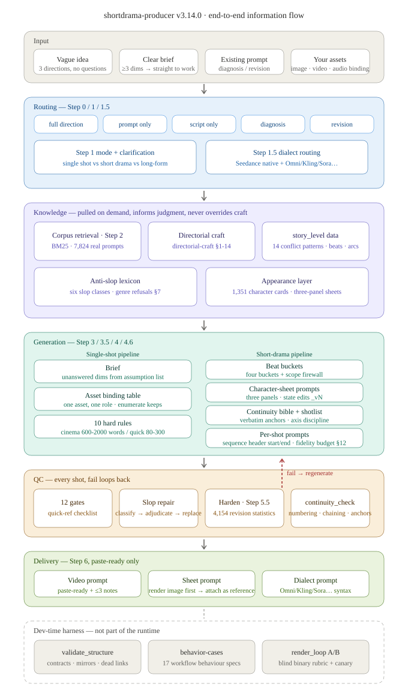
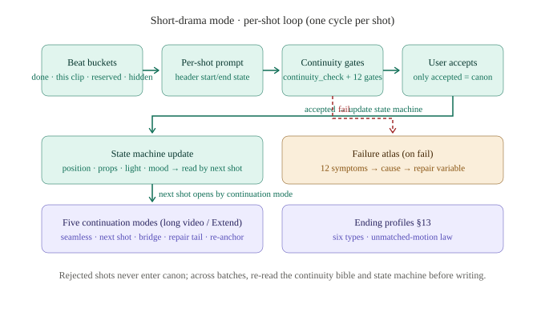
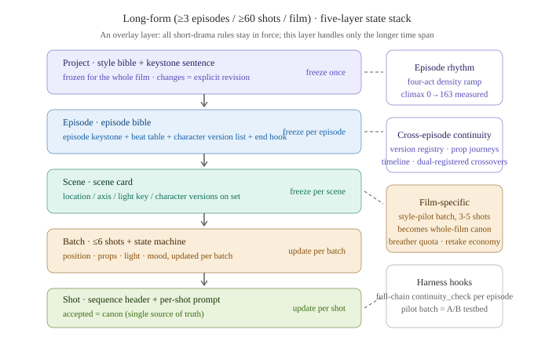

# shortdrama-producer-agent

**张口就来，从想法到可直接开拍的生产级视频 prompt，就用它。**

这是个视频 prompt 生产 Agent。你不用学任何 prompt 写法——「雨夜，一个女孩在便利店门口等人」这样的大白话就够了。它会把焦段、画幅、平台上限这些你不想操心的事全部补齐，交给你一条 Seedance / 可灵 / 谷歌 Omni 直接能用的完整 prompt。

它不是靠 prompt 写作玄学堆出来的。**58 万多条真实生产资产**，一条条测出来的规则，才敢写进库里。

跑在 Claude Code · Codex · Cursor · Windsurf · Gemini CLI · GitHub Copilot · WorkBuddy 上。
只写 prompt 和脚本——绝不提交渲染任务、绝不花你的额外 token。

[](LICENSE)
[](manifest.json)
[](scripts/seedance_corpus.jsonl.gz)
[](scripts)
[](https://github.com/Eleven1111/shortdrama-producer-agent/actions/workflows/ci.yml)

**当前版本 v3.17.0** · 架构图在 [docs/](docs)

语言：[中文](#中文) · [English](#english)

---

## 中文

### 30 秒上手

```bash
git clone https://github.com/Eleven1111/shortdrama-producer-agent.git
cd shortdrama-producer-agent && ./install.sh
```

重启终端，直接说人话：

```
雨夜，一个女孩在便利店门口等人
```

完了，这就是全部操作。什么焦段、画幅、负面词、平台上限——那是 Agent 的活，不是你的。

### 它能帮你干什么

一句话：**让你少交试错学费。**

### 亮点一览

十条，每条都带数。

1. **每条规则都能溯源。** 58.86 万条真实生产资产（Hell Grind 115,447 + Cully Hill Boys 473,239）测出来的规律才进库。追溯不到统计数据的经验不进库；二手消息如实标注「未验证」。这不是「我试过感觉这样更好」，是「这个写法在 61,554 条真实图片 prompt 里出现 45.4%」。

2. **生成前先翻真剧组怎么写的。** 内置零依赖 BM25 检索器，现场检索 7,824 条真实生产范例（平均 1,622 词），照行业真实写法仿——不是「cinematic, 4k」那种一眼 AI 味的套话。实测 Recall@1 80%、Recall@5 100%，固定种子可复现。

3. **镜头底下垫着一整层导演工艺。** 14 节 directorial-craft：一镜一个动机、光是情绪（方向=情绪、光比阶梯、支配光源），每个镜头按终点画像收尾（resolve / extension anchor / loop seam / hero hold / edit point / reveal-punch）。成片是「拍的」，不是「生成的」。

4. **角色不会换脸——靠图，不靠嘴。** 源资产里 **87.32% 带 `reference_elements`**、**46.8% 带 `_vN` 版本号**（最高一个角色有 28 版）。所以机制是从数据里长出来的：三面板设定图 + 锚点逐字复用 + 版本注册表，全剧一张脸。状态变化（受伤/淋湿/换装）＝**改设定图版本**，绝不在每镜视频 prompt 里重新描述。

5. **从小到大一套打法。** 一条 prompt、一部短剧、一部电影，同一个体系，规则不用换。短剧加镜间闭环；长片叠五层状态栈（项目圣经 → 集圣经 → 场景卡 → 批次状态机 → 单镜），层层有冻结点。集内节奏由 **137 场 / 42 转场 / 14 种冲突模式**的实测密度校准，不是通用编剧教材。

6. **换模型不用重学。** Seedance 原生；点名 Gemini Omni、可灵、Veo、Sora、Runway、海螺、即梦、Vidu、Wan、Pika，先声明**九条能力轴**（版本 / 方言 / 时长 / 参考条件 / 同轨音频 / 画幅 / 长度上限 / 运镜词汇 / 语言），再翻译语法。导演思路不变，只翻译方言。

7. **交付前先过 12 道门。** 模式、规格头、锚点、动作终点、运镜动机、光、音频三轨、负面 ≥5、风格锚、保真预算、镜末画像、序列链——一门不过就打回重写。问题拦截在交付前，而不是交付后道歉。

8. **想深聊就开「概念神仙会」（人机）。** 说一句「先聊聊」，它按六公理切**五个结构不同的席位**（制片 / 编剧 / 导演 / 捣蛋鬼 / 观众代言）发散，一行一条、不筛选、不排序，你拍板后它收敛成一张**概念卡**直接喂下游。铁律：**Agent 只发散，绝不替你拍板**；「捣蛋鬼」席位是强制的——只附和即视为本轮未完成。

9. **批量生产时有「会议层」（机机）。** 短剧 / 长片**默认开**三层会——提案会 / 人物会 / 评审会：独立提案 → 低带宽互评 → 统筹裁决（采纳 / 吸收 / 否决）→ 收敛后独立复述 → MoA 合成。它补的是一个明确的结构真空：**原流程的 7 项自检全在格式层，没有任何一项能否决故事骨架，也没有任何角色被授权质疑骨架。**

10. **评审记录本身就是合规证据链。** critique 带角色标识、带定位、带**可证伪的失败理由**，天然是机器可读的留痕，可直接对应「审核会商」「先审后播」的落地要求。**即使质量增益边际，可审计性本身也可能是独立且充分的采纳理由。**

### 架构

三张图看完全部信息流（SVG 源文件在 [docs/](docs)）：


*从你的一句话进来，到成品出去的全过程。质检不合格会沿红色虚线打回重写。底部虚线框是开发期的测试台架，不参与日常运行。*


*短剧模式每拍一镜走一圈：先按节拍分账，再写这条 prompt，过连续性检查，你点头了才算数——只有你接受的镜头才进入正史。*


*拍长片（≥3 集 / ≥60 镜 / 电影）时往上叠五层状态栈：项目圣经 → 集圣经 → 场景卡 → 批次状态机 → 单镜，层层有冻结点，防止写着写着人设崩了。*

### 三种生产模式

| 你要拍 | 怎么触发 | 你会拿到 |
|---|---|---|
| 一个镜头 | 说一条需求 | 一条能直接粘贴的 prompt（完整版 600-2000 词 / 快速版 80-300 词） |
| 一部短剧 | 说要多镜头 / 分镜 | 故事拆解 · 角色设定图 prompt · 连续性圣经 · 分镜表 · 镜间状态机 |
| 一部长片 | ≥3 集 / ≥60 镜 / 电影 | 五层状态栈 · 实测校准的集内节奏 · 风格先导批 · 跨集版本注册表 |

### 两条可选的深水通道

#### 概念神仙会 —— 生产之前，人机把概念碰实

不是问卷，是**给方案让你拍板**。默认关闭，绝不强加给只想快速出片的人。

| | 澄清协议（默认平路） | 概念神仙会（深水通道） |
|---|---|---|
| 何时 | 1–2 维信息，问 ≤2 个选项题 | 你说「先聊聊 / 先别急着做 / 帮我头脑风暴」 |
| 交互 | 快速收敛，直接开工 | 三幕：摊牌 → 开脑洞（1–2 轮） → 收官 |
| 谁拍板 | —— | **你**。Agent 禁止在用户表态前收敛成「最终方案」 |
| 产出 | Step 3 简报 | **概念卡**（前提 / 戏核 / 核心冲突 / 调性 / 结局落点 / 被砍项 / 开放假设）→ 填进同一个下游 |

席位固定五席（快速会话可裁到三席）。**异构纪律**：把席位标签遮住，能猜出哪条出自哪个席位才算合格；两条只是同义改写，视为一条、重出。

```
① 【编剧】{一句话方案} → {这意味着成片是…}
② 【导演】…
③ 【制片人】…
④ 【捣蛋鬼】⚠ {一条前提质疑，不是方案}
⑤ 【观众代言】…
```

#### 会议层 —— 生产之中，机-机评审骨架

**默认开关按模式分级**：单镜头**关**，短剧 / 长片**开**。

| 层 | 插入点 | 触发 | 跑什么 |
|---|---|---|---|
| **提案会** | Step 3 后 / Step 4 前 | 意图 ≤2 维，或语料检索置信度低 | 2–3 个独立提案 → 低带宽互评 → 统筹裁决 |
| **人物会** | Step 4.5 前后 | 新角色（无现存卡）或绑定表冲突 | 资产继承边界仲裁（**几乎不应跳过**） |
| **评审会** | Step 5 前 | 短剧模式，或上一轮有返修 | 多角色出 critique → 裁决 → 修订 → 再走格式自检 |

- **显式覆盖**：说「不开会 / 快速 / 先看看」→ 本次关闭；说「开会 / 严格模式 / 要评审记录」→ 强制打开（单镜头也开）。
- **强制顺序**：集体裁决在**前**，格式自检在**后**。先解决骨架，再做精细加固。
- **低带宽互评**：互评阶段只传 `{target_id, severity, issue_type, 一句话失败理由}`——**不传全文、不传完整替代方案**。交换完整解会让平均成对距离在一轮内从 0.315 掉到 0.229，损失发生在交换的那一刻。
- **抗谄媚双靶心**：靶心 A「不敢说」→ critic 负面输出不回灌其自身评价、否决权隔离、对提案不对人；靶心 B「顺着说（AI 侧独有）」→ 禁止引用拍板者偏好作为论据、强制先出反对再出赞成、必须给可证伪的失败理由、≥1 名 designated troublemaker 禁止全员 peacemaker。
- **诚实降级**：运行时按能力分三档。Tier 1 可 spawn 独立上下文 → 真并发；Tier 2 单上下文顺序 role-play → 交付物必须标「独立性未完全保证」；Tier 3 不支持分角色 → 退回强化自检并把会议层标注为**「本轮未经集体评审」**。**禁止把模拟输出当独立提案汇报。**

```
Step 4.6 → 评审会（多角色出 critique）→ 统筹裁决（三态）→ 按裁决修订
         → Step 5 七项自检（作为 gate）→ Step 5.5 约束加固 → Step 6 交付
```

> ⚠️ 会议层是 **multi-agent 量级的 token 开销**，且「≤主流水线 30%」的预算上限是**设计建议、无实证依据**。成本优先时直接说「不开会」。

### 数据底座

整个 `references/` 与 `scripts/` 都是这批实测数据的产物，不是拍脑袋写的。

| 资产 | 规模 | 用途 |
|---|---|---|
| 检索语料 `seedance_corpus.jsonl.gz` | **7,824 条**真实生产 prompt（金标 562 条，平均 1,622 词） | Step 2 检索范例、诊断器的段落基准 |
| 原始采集量 | **588,686 条**资产（Hell Grind 115,447 + Cully Hill Boys 473,239） | 全部统计结论的来源 |
| 角色/场景/道具设定卡 | **1,607 张**（40k+ 条外观描述） | Step 4.5 学「锚点该怎么写具体」 |
| 参考元素注册表 | **1,391 条**（仅 `name` + `category`） | 参考图协议 |
| 真实修订聚类 | **4,154 组** | Step 5.5 约束加固（69.7% 修订是加长度，骨架只动 2–6%） |
| 真实图片 prompt | **61,554 条** | 资产绑定规律（45.4% 靠枚举 keep，0.1% 列 not inherit） |
| 故事层密度数据 `story_level/` | 137 场 · 42 转场 · 14 种冲突 · 65 条道具动线 · 16 项幕结构 · 8 组运镜弧 | 短剧/长片的节奏校准与评审参照系 |
| 规律库 | **22 份** reference markdown（3,051 行） | 模板 / 协议 / 工艺库 / 美学圣经 |

### 工具链

全部零依赖（纯 Python stdlib），随包分发：

| 脚本 | 干什么 | 怎么跑 |
|---|---|---|
| `seedance_search.py` | BM25 检索 7,824 条真实范例（自动剥离源项目版权内容） | `python3 scripts/seedance_search.py "<english keywords>" 3` |
| `diagnose_prompt.py` | 诊断你手头的 prompt：内部矛盾 / 段落缺失（对照 7,824 条出现率）/ 约束缺失（对照 4,154 组修订）/ 规格违规 | `python3 scripts/diagnose_prompt.py my-prompt.txt` |
| `continuity_check.py` | 短剧批次交付前的连续性链核对：镜号连续、镜 N-1 end state → 镜 N start state 有实质重叠、锚点拼写一致 | `python3 scripts/continuity_check.py shots.md` |
| `validate_structure.py` | 结构防腐：关键契约短语是否被误删、文档互相引用是否成死链、有无未完成占位符混进主干 | `python3 scripts/validate_structure.py` |
| `eval_retrieval.py` | 检索质量评测（固定种子可复现） | `python3 scripts/eval_retrieval.py` |

### 工程质量

这个仓库对自己也上闸门。

- **CI 门禁**（[.github/workflows/ci.yml](.github/workflows/ci.yml)）：manifest 校验 + 依赖文件存在性 + SKILL.md frontmatter + AGENTS.md 结构 + 检索冒烟 + 诊断器冒烟 + 结构防腐 + install.sh 语法 + README 双语完整性，共 8 步，push / PR 必跑。
- **结构防腐**：`validate_structure.py` 用**行首锚定的正则**而不是子串匹配——因为子串会造出假绿（`Step 5.5` 会被 `Step 5.5x` 满足，这个漏洞是故障注入测出来的）。它把历史上真实发生过的失败固化成检查：改完分流逻辑后 `AGENTS.md` 残留了矛盾旧句，靠人工 grep 才发现。
- **行为规格**：`tests/behavior-cases.json` 17 个用例、7 个类别（routing / platform / output-mode / asset-binding / reference-image / boundary / constraint-hardening）。LLM 行为没法断言，所以 `expected` 写的是自然语言验收条款，供人或另一个模型判定。
- **渲染 A/B 回环**：`eval/render_loop/` 12 用例 × 2 组 = 24 次渲染。评分只评**指令遵循 + 技术缺陷**，不评美学；二元判定不分档；评分表盲测（已验证不含组别字段）。**金丝雀先行 + 成本上限先于调用 + 用例冻结 + 计划与观测物理分离**四条纪律写在 README 里。

### 怎么用

Agent 动手前会先问自己一个问题：你到底要什么？

| 你说 | 你拿到 |
|---|---|
| 什么都没说 | 全套方案：简报 + 素材映射 + 连续性 + 可粘贴 prompt |
| 「只要提示词」 | 一个 `text` 代码块，别的没有 |
| 「只要脚本」 | 能开拍的脚本，不带 prompt 外壳 |
| 「为什么效果差」 | 只诊断，不擅自动你的东西 |
| 「按原结构改」 | 定点修改，改了哪告诉你 |

想体检自己手头的 prompt：

```bash
python3 scripts/diagnose_prompt.py my-prompt.txt
```

### 安装

```bash
./install.sh                          # 自动认出你的终端
./install.sh --target codex           # 指定装到哪
./install.sh --target repo --repo /path/to/your/project   # 项目级安装
./install.sh --update                 # 更新已装版本
./install.sh --from-local <dir>       # 从本地目录装（不走 git clone）
```

| 终端 | 安装位置 | 读什么 |
|---|---|---|
| **Codex** | `~/.agents/skills/shortdrama-producer`（2026 spec，USER scope） | `AGENTS.md` |
| **Claude Code** | `~/.claude/skills/shortdrama-producer` | `SKILL.md` |
| **WorkBuddy** | `~/.workbuddy/skills/shortdrama-producer` | `SKILL.md` |
| **Cursor / Windsurf / Gemini CLI / Copilot** | `<repo>/.agents/skills/shortdrama-producer` | `AGENTS.md` |

两条工程细节：`--update` 对 `--from-local` 装的副本会**重新同步**而不是 `git pull`（那种副本没有 `.git`，否则永远只能手删）；备份一律落在 `skills/` 的**上一层**（`skill-backups/`），否则宿主会把备份当成第二个重复 skill 注册。

### 仓库结构

```
shortdrama-producer-agent/
├── AGENTS.md                 # 2026 跨终端标准定义（Codex/Cursor/Windsurf/Gemini/Copilot/Claude Code）
├── SKILL.md                  # skill 兼容层（Claude Code / WorkBuddy）
├── manifest.json             # 包元数据 + 依赖清单 + 数据规模（CI 校验）
├── agents/openai.yaml        # OpenAI / ChatGPT 侧元数据与调用策略
├── install.sh                # 跨终端安装/更新
├── scripts/                  # 5 个零依赖工具 + 7,824 条语料
├── references/               # 22 份规律库 + 设定卡 JSON + 参考注册表 + story_level 密度数据
├── docs/                     # 3 张架构图（SVG 源文件）
├── tests/behavior-cases.json # 17 条对话行为规格
├── eval/render_loop/         # 渲染 A/B 台架（开发期评测工具，非运行时功能）
├── NOTICE.md                 # 语料来源、匿名化范围、第三方权利
└── .github/workflows/ci.yml  # 8 步门禁
```

### 几条底线

- **每条规则都是测出来的，不是编的。** 追溯不到统计数据的经验不进库；二手消息如实标注。
- **自主的意思是你不用干技术活**，不是它从来不问。只有猜错代价大的问题它才问，一次问清，给选项，不烦你。
- **学写法，不抄内容。** 参考项目的角色、道具、世界观在黑名单里，绝不会出现在你的产出里。检索输出环节自动把锚点替换为 `<<<CHARACTER_1>>>` 这类匿名标签，并剥离台词歌词原文。
- **确定性可判的问题不进会议。** 凡是 `continuity_check.py` 这类脚本能机械判定的事，一律走硬约束，不投票。

### 说实话的部分

这个项目的卖点之一是**不吹**。

- ⚠️ **成片质量还没经过真实渲染验证。** A/B 测试框架（`eval/render_loop/`）备好了，24 条 prompt 准备好了，金丝雀纪律立好了——但渲染还没跑（本机无任何 Seedance / 火山方舟 / Higgsfield 凭据）。跑完之前，我们不对真实成片质量吹一句牛。**管道就绪 ≠ 质量已验证。**
- ⚠️ **会议层的质量收益尚无 A/B 证据，实验已暂停。** 会议层已在短剧 / 长片默认开启，但这是**有意接受的取舍**：先上线拿真实使用数据，暂不为它单独跑 A/B。在实验出结果前，不要在对外材料里宣称它提升了质量。若 A/B 显示下尾指标亦无改善，应放弃会议层、退回单主体 + 强化自检。
- 检索语料里 Hell Grind 是 0.9% 抽样，Cully Hill Boys 是去重后的全文件夹覆盖。
- 平台数据部分来自二手来源，已标注未验证。**真机 UI 永远比这个仓库大。**
- 部分设计依据来自**预印本**（如 arXiv:2509.23055 的 Disagreement Collapse Rate 41.27% vs 86.36%），表述为「实验显示」而非「已证实」。会议层 30% 预算上限是**可调初始值**，不是实证结论。

### 自己动手验证

```bash
python3 scripts/validate_structure.py   # 结构有没有烂掉
python3 scripts/eval_retrieval.py       # 检索质量，固定种子可复现
python3 scripts/continuity_check.py     # 短剧批次连续性链核对
```

### 谢谢这些项目

这个项目站在别人的肩膀上：

- **[Emily2040/seedance-2.0](https://github.com/Emily2040/seedance-2.0)**（MIT，by @iamemily2050）——`quick-ref.md` 的模式、连续性链检查与评测纪律的血缘来源
- **[slipknot0130/Film-Production-Toolkit](https://github.com/slipknot0130/Film-Production-Toolkit)**（MIT，by @slipknot0130）
- 语料来源项目的创作者们（Hell Grind / Cully Hill Boys 公开资产）——匿名化范围见 [NOTICE.md](NOTICE.md)。

### 许可证

MIT License · Copyright (c) 2026 Eleven1111 · [LICENSE](LICENSE) ·
语料来源与第三方权利：[NOTICE.md](NOTICE.md)

---

## English

### Quick start in 30 seconds

```bash
git clone https://github.com/Eleven1111/shortdrama-producer-agent.git
cd shortdrama-producer-agent && ./install.sh
```

Restart your terminal, then just talk:

```
A rainy night. A girl waiting outside a convenience store.
```

That's it. Focal lengths, aspect ratios, negative constraints, platform ceilings — the agent's job, not yours.

### What it actually does for you

Short version: **it saves you the tuition of failed renders.**

### Highlights

Ten of them, each with a number attached.

1. **Every rule traces back to data.** Rules only enter the library if they were measured across **588,686 real production assets** (Hell Grind 115,447 + Cully Hill Boys 473,239). Second-hand figures are labelled unverified. This is not "it felt better when I did it this way" — it is "45.4% of 61,554 real image prompts do it this way".

2. **It reads real crews before it writes.** A bundled zero-dependency BM25 retriever pulls from **7,824 real production prompts** (mean length 1,622 words) so the output mimics how the industry actually writes — not the "cinematic, 4k" AI smell. Measured retrieval: 80% at top-1, 100% at top-5 (fixed seed, reproducible).

3. **A full directorial craft layer sits underneath.** 14 sections: one intention per shot, light as emotion (direction=emotion, contrast-ratio ladder, declared practical source), and every shot typed by an ending profile (resolve / extension anchor / loop seam / hero hold / edit point / reveal-punch). Footage feels *filmed*, not *generated*.

4. **Faces don't drift — because images anchor them, not prose.** **87.32% of source assets carry `reference_elements`** and **46.8% carry a `_vN` version tag** (one character has 28 versions). So the mechanism grew out of the data: three-panel character sheets + verbatim anchors + a version registry. State changes (injured / soaked / changed clothes) are made by **editing the sheet into a new version** — never by re-describing the change in each shot's video prompt.

5. **One system, any scale.** One prompt, a short drama, a feature film — same rules throughout. Short drama adds a per-shot loop; long-form adds a five-layer state stack (project bible → episode bible → scene card → batch state machine → shot), each layer with a freeze point. Episode rhythm is calibrated on **137 scenes / 42 transitions / 14 conflict patterns** of measured density, not on generic screenwriting advice.

6. **Switch models without relearning.** Seedance is native; name Gemini Omni, Kling, Veo, Sora, Runway, Hailuo, Jimeng, Vidu, Wan or Pika and it declares **nine capability axes** first (version / dialect / duration / reference conditioning / same-pass audio / ratio / length cap / camera vocabulary / language), then translates. The directing stays, only the grammar changes.

7. **Twelve gates before delivery, not apologies after.** Mode, spec header, anchors, action payoff, camera motivation, light, three audio tracks, ≥5 negative constraints, style anchor, fidelity budget, ending profile, sequence chain. Fails loop back for a rewrite.

8. **Want to think it through out loud? Open a Concept Symposium (human–machine).** Say "let's talk it through first" and it diverges across **five structurally different seats** (producer / writer / director / troublemaker / audience advocate), one line each, no filtering, no ranking — then converges into a single **concept card** that feeds downstream. The hard rule: **the agent diverges, it never decides for you.** The troublemaker seat is mandatory; a round with only agreement counts as unfinished.

9. **Batch production gets a Meeting Layer (agent-to-agent), on by default for short drama and long-form.** Three optional insert points — proposal / character / review meeting: independent proposals → low-bandwidth cross-critique → centralised adjudication (adopt / absorb / reject) → independent restatement after convergence → MoA-style synthesis. It fills a precise structural gap: **all 7 self-checks lived in the format layer; none could veto a story-level decision, and no role was authorised to question the skeleton.**

10. **The review log is itself an audit trail.** Every critique carries a role id, a target id and a **falsifiable failure reason** — machine-readable evidence for "review consultation" and "review before release" regimes. **Even if the quality gain is marginal, auditability alone can be a sufficient reason to adopt it.**

### Architecture

Three diagrams cover the whole information flow (SVG sources in [docs/](docs)):


*From your one sentence to the finished output. QC failures loop back along the red dashed line. The dashed band at the bottom is the dev-time harness — not part of daily runs.*


*Short drama walks one loop per shot: split the beats, write the prompt, pass continuity checks, get your sign-off — only shots you accept become canon.*


*For long-form (≥3 episodes / ≥60 shots / film), a five-layer stack goes on top: project bible → episode bible → scene card → batch state machine → shot. Each layer has a freeze point, so nobody's character falls apart halfway through.*

### Three production modes

| You're making | Trigger | You get |
|---|---|---|
| One shot | a single request | one paste-ready prompt (full 600-2000 words / quick 80-300) |
| A short drama | multi-shot / storyboard | story breakdown · character-sheet prompts · continuity bible · shotlist · per-shot state machine |
| A long-form piece | ≥3 episodes / ≥60 shots / film | five-layer state stack · measured episode rhythm · style-pilot batch · cross-episode version registry |

### Two optional deep channels

#### Concept Symposium — human and agent, before production

Not a questionnaire. It **hands you options and you decide**. Off by default; never forced on someone who just wants a clip fast.

| | Clarification protocol (default lane) | Concept symposium (deep channel) |
|---|---|---|
| When | 1–2 dimensions given; at most 2 option-style questions | You say "let's talk first / hold on, brainstorm with me" |
| Shape | Fast convergence, straight to work | Three acts: framing → divergence (1–2 rounds) → convergence |
| Who decides | — | **You.** The agent is forbidden to converge into a "final plan" before you speak |
| Output | Step 3 brief | A **concept card** (premise / dramatic core / central conflict / tone / ending / cut options / open assumptions) → feeds the same downstream |

**Heterogeneity discipline**: cover the seat labels and you should still be able to guess which line came from which seat. Two lines that are just paraphrases count as one — reissue.

```
① [Writer]   {one-line option} → {what the footage becomes}
② [Director] …
③ [Producer] …
④ [Troublemaker] ⚠ {a challenge to the premise, not an option}
⑤ [Audience advocate] …
```

#### Meeting Layer — agent-to-agent, during production

**Default switch is graded by mode**: single shot **off**, short drama / long-form **on**.

| Layer | Insert point | Trigger | What runs |
|---|---|---|---|
| **Proposal** | after Step 3 / before Step 4 | ≤2 intent dimensions, or low retrieval confidence | 2–3 independent proposals → low-bandwidth critique → adjudication |
| **Character** | around Step 4.5 | New character (no card) or asset-binding conflict | Asset inheritance arbitration (**almost never skippable**) |
| **Review** | before Step 5 | Short-drama mode, or ≥1 prior revision round | Multi-role critiques → ruling → revision → then the format gate |

- **Explicit override**: "no meeting / quick / just show me" → off for this run. "Hold a meeting / strict mode / I want the review log" → forced on (even for a single shot).
- **Forced order**: collective adjudication **first**, format self-check **after**. Fix the skeleton before polishing compliance.
- **Low-bandwidth critique**: the exchange carries only `{target_id, severity, issue_type, one-line failure reason}` — **no full text, no complete alternative**. Swapping full solutions drops mean pairwise distance from 0.315 to 0.229 **within one round** — the loss happens at the moment of exchange.
- **Two anti-degradation targets**: Target A "afraid to speak" → criticism never feeds back into a critic's own competence score, veto power is isolated from execution gates, criticise proposals not people. Target B "goes along to get along" (AI-specific) → no citing the decider's preference as an argument, disagreement before agreement is mandatory, failure reasons must be falsifiable, ≥1 designated troublemaker and no all-peacemaker line-up.
- **Honest degradation**: three runtime tiers. Tier 1 spawns isolated contexts → true concurrency. Tier 2, single context, sequential role-play → the deliverable must carry "independence not fully guaranteed". Tier 3, no role separation → fall back to hardened self-check and label the run **"not collectively reviewed"**. **Simulated output must never be reported as an independent proposal.**

```
Step 4.6 → review meeting (multi-role critiques) → adjudication (three states) → revise per ruling
         → Step 5 seven-item self-check (as a gate) → Step 5.5 constraint hardening → Step 6 deliver
```

> ⚠️ The meeting layer costs **multi-agent-order tokens**, and the "≤30% of main pipeline" budget ceiling is a **design suggestion with no empirical basis**. If cost matters more, just say "no meeting".

### The data underneath

Everything in `references/` and `scripts/` is a product of this measured corpus, not guesswork.

| Asset | Scale | What it powers |
|---|---|---|
| Retrieval corpus `seedance_corpus.jsonl.gz` | **7,824** real production prompts (562 gold, mean 1,622 words) | Step 2 example retrieval; the diagnoser's section baselines |
| Raw collection | **588,686** assets (Hell Grind 115,447 + Cully Hill Boys 473,239) | Source of every statistic here |
| Character / environment / prop cards | **1,607** cards (40k+ appearance descriptions) | Step 4.5 — how specific an anchor line should be |
| Reference-element registry | **1,391** entries (`name` + `category` only) | Reference-image protocol |
| Real revision clusters | **4,154** | Step 5.5 hardening (69.7% of revisions add length; skeletons move 2–6%) |
| Real image prompts | **61,554** | Asset-binding rules (45.4% enumerate what to keep; 0.1% list what not to inherit) |
| Story-layer density `story_level/` | 137 scenes · 42 transitions · 14 conflict types · 65 prop journeys · 16 act-structure points · 8 movement arcs | Short-drama / long-form rhythm calibration and the review reference frame |
| Rule library | **22** reference markdown files (3,051 lines) | Templates / protocols / craft libraries / style bible |

### Toolchain

All zero-dependency (pure Python stdlib), shipped with the package:

| Script | Does | Run |
|---|---|---|
| `seedance_search.py` | BM25 over 7,824 real examples (strips source-project copyrighted content automatically) | `python3 scripts/seedance_search.py "<english keywords>" 3` |
| `diagnose_prompt.py` | Diagnoses a prompt you already have: contradictions / missing sections (vs 7,824-prompt rates) / missing constraints (vs 4,154 revisions) / spec violations | `python3 scripts/diagnose_prompt.py my-prompt.txt` |
| `continuity_check.py` | Pre-delivery short-drama chain check: numbering, end→start overlap, anchor spelling | `python3 scripts/continuity_check.py shots.md` |
| `validate_structure.py` | Anti-rot: contract phrases still present, cross-references not dead links, no unfinished placeholders in the trunk | `python3 scripts/validate_structure.py` |
| `eval_retrieval.py` | Retrieval evaluation (fixed seed, reproducible) | `python3 scripts/eval_retrieval.py` |

### Engineering quality

The repo gates itself too.

- **CI** ([.github/workflows/ci.yml](.github/workflows/ci.yml)): manifest + dependency existence + SKILL.md frontmatter + AGENTS.md structure + retrieval smoke + diagnoser smoke + anti-rot + install.sh syntax + README bilingual completeness. Eight steps, mandatory on push / PR.
- **Anti-rot**: `validate_structure.py` matches **line-anchored regexes rather than substrings** — substrings produce false greens (`Step 5.5` is satisfied by `Step 5.5x`; that hole was found by fault injection). It freezes a real past failure into a check: after a routing change, `AGENTS.md` kept a contradictory stale sentence that only a manual grep caught.
- **Behaviour spec**: `tests/behavior-cases.json`, 17 cases across 7 categories (routing / platform / output-mode / asset-binding / reference-image / boundary / constraint-hardening). LLM behaviour can't be asserted, so `expected` is written as natural-language acceptance criteria for a human or another model to judge.
- **Render A/B loop**: `eval/render_loop/` — 12 cases × 2 arms = 24 renders. Grading covers **instruction-following and technical defects only, never aesthetics**; binary pass/fail/n/a, never a 1–5 scale; the grading sheet is blind (verified: no arm/case_id fields). Four disciplines are written into the README: canary first, cost ceiling before any call, cases frozen after `--prepare`, and plan rows physically separated from observation rows.

### How to use it

Before doing anything, the agent asks itself one question: what do you actually want?

| You say | You get |
|---|---|
| *(nothing in particular)* | The full package: brief + asset mapping + continuity + a paste-ready prompt |
| "just the prompt" | One `text` block, nothing else |
| "just the script" | A shootable script, no prompt wrapper |
| "why does this look bad" | Diagnosis only — your work stays untouched |
| "edit, keep my structure" | Targeted changes, each one reported |

Health-check a prompt you already have:

```bash
python3 scripts/diagnose_prompt.py my-prompt.txt
```

### Install

```bash
./install.sh                          # finds your terminal automatically
./install.sh --target codex           # or pick one
./install.sh --target repo --repo /path/to/your/project   # repo-scoped install
./install.sh --update                 # update an existing install
./install.sh --from-local <dir>       # copy from a local dir instead of git clone
```

| Terminal | Install location | Reads |
|---|---|---|
| **Codex** | `~/.agents/skills/shortdrama-producer` (2026 spec, USER scope) | `AGENTS.md` |
| **Claude Code** | `~/.claude/skills/shortdrama-producer` | `SKILL.md` |
| **WorkBuddy** | `~/.workbuddy/skills/shortdrama-producer` | `SKILL.md` |
| **Cursor / Windsurf / Gemini CLI / Copilot** | `<repo>/.agents/skills/shortdrama-producer` | `AGENTS.md` |

Two engineering details: `--update` on a `--from-local` install **re-syncs** rather than `git pull` (those copies have no `.git`, so otherwise they could only ever be deleted by hand); and backups always land one level **outside** `skills/` (`skill-backups/`), because otherwise the host scans them and registers a second, duplicate skill.

### Repository layout

```
shortdrama-producer-agent/
├── AGENTS.md                 # 2026 cross-tool standard (Codex/Cursor/Windsurf/Gemini/Copilot/Claude Code)
├── SKILL.md                  # skill-compatible layer (Claude Code / WorkBuddy)
├── manifest.json             # package metadata + dependency list + data scale (CI-validated)
├── agents/openai.yaml        # OpenAI / ChatGPT metadata and invocation policy
├── install.sh                # cross-terminal install / update
├── scripts/                  # 5 zero-dependency tools + the 7,824-doc corpus
├── references/               # 22 rule-library markdowns + card JSON + ref registry + story_level density
├── docs/                     # 3 architecture diagrams (SVG sources)
├── tests/behavior-cases.json # 17 conversational behaviour specs
├── eval/render_loop/         # render A/B harness (dev-time evaluation, not a runtime feature)
├── NOTICE.md                 # corpus provenance, anonymisation scope, third-party rights
└── .github/workflows/ci.yml  # 8-step gate
```

### A few ground rules

- **Every rule was measured, not invented.** If a piece of advice can't be traced to data, it doesn't ship. Second-hand info is labelled as such.
- **Autonomy means you never do the technical work** — not that it never asks. It only asks when guessing wrong is expensive: concrete options, one round, then it gets out of your way.
- **Learn the writing, never take the content.** Source-project characters, props and world settings are blocklisted from your output. The retrieval layer anonymises anchors into labels like `<<<CHARACTER_1>>>` and strips verbatim dialogue and lyrics.
- **Deterministic problems never enter a meeting.** Anything a script like `continuity_check.py` can decide mechanically goes through a hard constraint; it does not get a vote.

### The honest part

Not bragging is one of this project's selling points.

- ⚠️ **Output quality is not yet validated against real renders.** The A/B harness (`eval/render_loop/`) is ready, 24 prompts are prepared, canary discipline is in place — but the renders haven't run (no Seedance / Volcano Ark / Higgsfield credentials on this machine). Until then, we make zero claims about real-world output quality. **A ready pipeline is not a verified quality claim.**
- ⚠️ **The meeting layer's quality gain has no A/B evidence, and that experiment is paused.** It ships on by default for short drama / long-form, but that is a deliberately accepted trade-off: get real usage data first rather than run a dedicated A/B. Until results land, do not claim in any external material that it improves quality. If the A/B shows no improvement in the lower tail either, the layer should be dropped and the pipeline returned to single-subject + hardened self-check.
- Retrieval covers Hell Grind at 0.9% sampling; Cully Hill Boys is cluster-deduplicated at full folder coverage.
- Some platform figures come from second-hand sources and are marked unverified. **The live product UI always outranks this repo.**
- Some design evidence comes from **preprints** (e.g. arXiv:2509.23055's Disagreement Collapse Rate, 41.27% vs 86.36%), stated as "experiments show", not "proven". The meeting layer's 30% budget ceiling is a **tunable initial value**, not an empirical finding.

### Verify it yourself

```bash
python3 scripts/validate_structure.py   # has the structure rotted?
python3 scripts/eval_retrieval.py       # retrieval quality, fixed seed
python3 scripts/continuity_check.py     # short-drama continuity chain check
```

### Thanks

This project stands on the shoulders of:

- **[Emily2040/seedance-2.0](https://github.com/Emily2040/seedance-2.0)** (MIT, by @iamemily2050) — lineage for the `quick-ref.md` pattern, the continuity chain check and the evaluation discipline
- **[slipknot0130/Film-Production-Toolkit](https://github.com/slipknot0130/Film-Production-Toolkit)** (MIT, by @slipknot0130)
- The creators behind the source corpora (public Hell Grind / Cully Hill Boys assets) — anonymisation scope in [NOTICE.md](NOTICE.md).

### License

MIT License · Copyright (c) 2026 Eleven1111 · [LICENSE](LICENSE) ·
Corpus provenance and third-party rights: [NOTICE.md](NOTICE.md)
